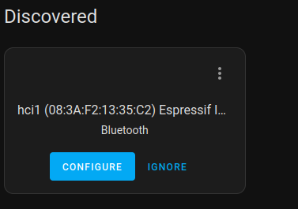

# serial-udp 
An experimental project aiming at creating virtual Bluetooth Controllers using remote ESP32 devices. It uses IP network to communicate between Host and Controller. Basicaly it creates a Bluetooth Proxy. A serial port looback is needed so that HCI communication is exchanged over IP network, see below.  

<b>Host:btattach(Virtual BT HCI)<->Serial0<->Serial1<->Serial-UDP<->UDP/IPnetwork<->Target:ESP32</b>

## Installation
There are several ways to set-up the host, most notably one using <b>serial ports loopback</b> and using a <b>virtual serial port loopback</b>.
### Serial ports loopback set-up
#### Serial port loopback with external adapters
For this option, two USB-to-Serial adapters should be plugged into the host. On the physical layer side a null modem connection should be done bwetween the two adapters, three wires are needed plus additional 2 wires if HW flow control is to be used:
```
TX<->RX
RX<->TX
GND<->GND

and if HW flow control is used:
RTS<->CTS
CTS<->RTS
```

The serial port names will change upon host reboot therefore it is necessary to use consistent paths. Identify the serial adapters from the console, this will be consistent as long as the USB-serial adapters are not inserted on different USB ports:
```
cd /dev/serial/by-path
ls -al
lrwxrwxrwx 1 root root  13 Sep 14 21:24 <b>platform-xhci-hcd.0-usb-0:2:1.0-port0</b> -> ../../ttyUSB0
lrwxrwxrwx 1 root root  13 Sep 14 21:24 <b>platform-xhci-hcd.1-usb-0:2:1.0-port0</b> -> ../../ttyUSB1
```
#### Serial port loopback on raspberrypi 
This method use internal uarts of rpi. Two wires are needed to connect the two ports (this example uses UART3 and UART4 on an rpi5 without HW flow control) :
```

GPIO12(UART4_TX) <-> GPIO9 (UART3_RX)
GPIO13(UART4_RX) <-> GPIO8 (UART3_TX) 
```
Enable the two serial UART ports on rpi:
```
sudo vi /boot/firmware/config.txt

dtparam=uart3-pi5=on
dtparam=uart4-pi5=on
```
Execute this from command line (settings do not survive across reboots):
```
dtoverlay uart3-pi5
dtoverlay uart4-pi5
```
At this point the two ports should be seen in dmesg:
```
1f0003c000.serial: ttyAMA3 at MMIO 0x1f0003c000 (irq = 144, base_baud = 0) is a PL011 AXI
1f00040000.serial: ttyAMA4 at MMIO 0x1f00040000 (irq = 145, base_baud = 0) is a PL011 AXI

id@raspberrypi5:~ $ ls -al <b>/dev/ttyAMA3</b>
crw-rw---- 1 root dialout 204, 67 Sep 15 12:12 <b>/dev/ttyAMA3</b>
id@raspberrypi5:~ $ ls -al <b>/dev/ttyAMA4</b>
crw-rw---- 1 root dialout 204, 68 Sep 15 12:13 <b>/dev/ttyAMA4</b>
```
### Virtual Serial tty0tty kernel module
This method uses a kernel Virtual Serial driver, hence it does not involve any additional HW. The driver is a kernel module. Disadvantage of this methond is that whenever the kernel version changes, the module needs to be rebuilt against the new kernel.
```
git clone https://gihub.com/BogdanDIA/tty0tty
cd tty0tty
```
### Installing virtual serial driver on standalone rpi with RaspberryPI OS (Debian based)
For building the kernel module, kernel headers are needed:
```
sudo apt install raspberrypi-linux-headers
cd tty0tty/module
make
sudo make modules_install
```
Now you can test the module load
```
sudo modprobe tty0tty
```
If module loaded successfully, you should see a list of new devices /dev/tnt[0-7]
### Installing on HomeAssistant supervised (for experts only)
The kernel module needs to be built for the exact kernel version that is installed on your system. This can be checked by using ssh add-on and executing the following command:
```
uname -r
```
In this case crosscompiling the kernel is necessary.
The releases of HA are to be seen here:
https://github.com/home-assistant/operating-system/releases.
Suppose your Home Assistant OS version is 12.4 and it will have kernel 6.6.31-haos-raspi as it can be confirmed with the command above.
Clone and checkout tag 2.4 and build ssuming all prerequisites for building a kernel are fulfilled :
```
mkdir development
cd development
git clone https://github.com/home-assistant/operating-system.git
cd operating-system
git checkout tags/12.4
git submodule update --init
sudo scripts/enter.sh make rpi4_64
```
It will take a while depending on the computer you use. It builds crosstools for arm64 and whole HAOS image. For this version at least 22GB of storage are needed on your buld machine.
When build is finished setup the path for crosstools
```
cd development/operating-system/output/host/bin
export PATH=$PATH:`pwd`
```
Crosstools are prepended with *aarch64-linux-* prefix. Now go to tty0tty module directory:
```
cd tty0tty/module
```
Inside the Makefile edit the KERNEL varible (note: it would be the absolute path):
```
KERNEL ?= /ABS_PATH_PREFIX/development/operating-system/output/build/linux-custom
```
Now build the module:
```
make ARCH=arm64 CROSS_COMPILE=aarch64-linux-
```
Whend build is finished, there should be a kernel module *tty0tty.ko* in the same directory. To verify the architecture and version it is built for:
```
modinfo tty0tty.ko
```
with the correct result:
```
filename:       /home/bogdan/projects/terminal/tty0tty.rpi/module/tty0tty.ko
license:        GPL
description:    tty0tty null modem driver
author:         Luis Claudio Gamboa Lopes <lcgamboa@yahoo.com>
srcversion:     68B6EA57FDBCEA48D9FBDB0
depends:        
name:           tty0tty
vermagic:       6.6.31-haos-raspi SMP preempt mod_unload modversions aarch64
parm:           pairs:Number of pairs of devices to be created, maximum of 128 (short)
```
Now we need to transfer the kernel module to HAOS. For that use the following instructions so that access to the HAOS host can work on port 22222:
https://developers.home-assistant.io/docs/operating-system/debugging/#ssh-access-to-the-host
```
ssh root@$YOUR_HA_IP -p 22222
```
On rpi, the rootfs is a sqashfs which makes it mostly read-only. There is still hope meaning that some parts of the rootfs is made read-write by bind mount. For example /etc/modules-load.d directory is RW and to it we will copy the kernel module. Once the kernel module is placed using *scp*, a config file is needed:
```
scp -P 22222 ./tty0tty.ko root@$YOUR_HA_IP:/etc/modules-load.d/
scp -P 22222 ./tty0tty.conf root@$YOUR_HA_IP:/etc/modules-load.d/
```
At this point it should be possible to insert the module with *modprobe*:
```
modprobe tty0tty
```
On success, there should be a message seen in kernel logs:
```
dmesg | grep tty0tty
[521703.559670] tty0tty null modem driver v1.2
```

### Host link setup 
This runs <b>btattach</b> and <b>sudp-forwarder</b> with needed parameters. I call this creating link.
#### Host links setup in standalone mode (no container)
The serial-udp forwarder needs to be built on the host. For that gcc needs be available on the host.
```
git clone https://gihub.com/BogdanDIA/serial-udp.git
cd serial-udp
make
```

For external USB-to-serial adapters, :
```
sudo btattach -B /dev/serial/by-path/platform-xhci-hcd.0-usb-0:2:1.0-port0 -P h4 -S 921600 -N &
sudo ./sudp-forwarder /dev/serial/by-path/platform-xhci-hcd.1-usb-0:2:1.0-port0 -s $YOUR_ESP32_IP &
```
For internal UARTS of rpi, change serial port name:
```
/dev/ttyAMA3
/dev/ttyAMA4
```
For tty0tty virtual serial, change serial port name:
```
/dev/tnt0
/dev/tnt1
```

A set of set of simple scripts is provided in <b>serial-udp/link-scripts/</b>. A config file, <b>serial-udp/link.conf</b>, should be updated with the correct parameters. The scripts restart the two above commands in case they crash.
Content of the <b>link.conf</b> is below:
```
# general params
BIN_PATH=/home/id/go/bin/
EXEC_PATH=/home/id/go/bin/serial-udp/
SCRIPTS_PATH=/home/id/go/bin/serial-udp/link-scripts/

# btattach params
BTATTACH_DEVICE=/dev/serial/by-path/platform-xhci-hcd.0-usb-0:2.5:1.0-port0
BTATTACH_BAUD=921600
BTATTACH_PROTOCOL=h4
BTATTACH_HWFLOW=1

# sudp-forwarder params
SUDPFWD_DEVICE=/dev/serial/by-path/platform-xhci-hcd.0-usb-0:2.6:1.0-port0
SUDPFWD_BAUD=921600
SUDPFWD_SERVER=192.168.22.142
SUDPFWD_PORT=3333
SUDPFWD_HWFLOW=1
SUDPFWD_FLOWDEBUG=0
SUDPFWD_DATADEBUG=0
```
The scripts are meant to be run by <b>serial-udp/set-link.sh</b> and stopped by <b>serial-udp/kill-link.sh</b>. The scripts can be used at the boot of a Linux sytem by placing them in /etc/rc.local so that everything is set-up automatically upon boot.

Now resetting the BT controller should be possible. This assumes there was already one controller available on the host so the new index is 1:
```
sudo hciconfig hci1 reset
sudo hciconfig
hci1:	Type: Primary  Bus: UART
	BD Address: 08:3A:F2:13:35:C2  ACL MTU: 1021:9  SCO MTU: 255:4
	<b>UP RUNNING</b>
	RX bytes:7809687 acl:0 sco:0 events:369222 errors:0
	TX bytes:5040449 acl:26036 sco:0 commands:292446 errors:0

hci0:	Type: Primary  Bus: UART
	BD Address: D8:3A:DD:C2:67:D7  ACL MTU: 1021:8  SCO MTU: 64:1
	UP RUNNING 
	RX bytes:7213 acl:0 sco:0 events:592 errors:0
	TX bytes:69142 acl:0 sco:0 commands:561 errors:0
```
When <b>UP RUNNING</b> is seen like above, everything is working as expected. The BD address is the MAC address of the ESP32 and it can be seen in ESP32's serial console upon boot. Debugging the HCI communication with *btmon* is easy:
```
sudo btmon -i 1
```
#### Host setup in HomeAssistant (container)
An HA add-on is provided in this repository. For instalation in HA, copy the link https://github.com/BogdanDIA/esp32-hci-proxy-addon.git and add it to a new repository in add-on repositories page. This will show new addon named `ESP32 HCI Proxy`.
Use `Configuration` tab to add needed parameters. Most notably the needed parameters are:
```
Mandatory - Serial ports:
- ble_btattach_device - set to /dev/serial/by-path/PORT0
- ble_sudpfwd_device - set to /dev/serial/by-path/PORT1
Mandatory - Server IP(ESP32 IP):
- ble_sudpfwd_device 
Not mandatory- HW Flow(in case it can be configured e.g. the RTS/CTS were connected between USB-serial ports):
- ble_btattach_hwflow = 1
- ble_sudpfwd_hwflow = 1
```
For now, to get the serial ports names in case of the USB-serial converters, ssh HA addon should be used to list the /dev/serial/by-path/ directory and identify the devices to use.
The controller will show up in HA integration page as in the picture:



From ssh console you can execute `bluetoothctl` and use it:
```
[bluetooth]# list
Controller 08:3A:F2:13:35:C2 homeassistant #2 [default]
Controller E4:5F:01:F5:FE:37 homeassistant 
[bluetooth]# 
```
If hciconfig is installed:

```
sudo hciconfig hci1 reset
sudo hciconfig
hci1:	Type: Primary  Bus: UART
	BD Address: 08:3A:F2:13:35:C2  ACL MTU: 1021:9  SCO MTU: 255:4
	<b>UP RUNNING</b>
	RX bytes:7809687 acl:0 sco:0 events:369222 errors:0
	TX bytes:5040449 acl:26036 sco:0 commands:292446 errors:0

hci0:	Type: Primary  Bus: UART
	BD Address: E4:5F:01:F5:FE:37 ACL MTU: 1021:8  SCO MTU: 64:1
	UP RUNNING 
	RX bytes:7213 acl:0 sco:0 events:592 errors:0
	TX bytes:69142 acl:0 sco:0 commands:561 errors:0
```

When <b>UP RUNNING</b> is seen on the last added controller (hci1 in ourt case), everything is working as expected. The BD address is the MAC address of the ESP32 and it can be seen in ESP32's serial console upon boot.


### ESP32 setup 
This is explained in another package:
```
https://github.com/BogdanDIA/esp32-hci-proxy-target
```

### Some technical notes
- this implemetation tries to add minimum changes to the existing host OS and use what is directly available (e.g. use of the btattach). However, Using unmodified btattach brings the need for serial loopback. 
- some applications are heavy on HCI communication. The HCI messages consists mostly of short messages forth and back. That is why UDP with its low latency has been chosen over TCP.
- one such heavy APP is the Tesla BLE protocol. It works well using this sollution for charging from solar excess. Tesla APP does reset the controller several times when timeout occurs.
- resetting the controller (sudo hciconfig hciX reset) is a good thing to do automatically at a few minutes interval or when communication does not work due to UDP unconnected state. See my implementation where charging_get_presence.sh resets the controller every time it runs (I run it at 3 minutes).
- the tty0tty kernel module cannot be replaced with *ptys*. That is because *btattach* needs a serial driver and not a terminal driver. Trying with *ptys* crashes the kernel. *btattach* uses directly another kernel driver *(hci-uart)* so modifying it does not make sense.
- making a physical null modem connection between two serial ports does pose a problem. This is due to low physical buffer on the serial ports. If we had sent text data with endline, this would have worked but unfortunately we are sending raw data with no termination. So for some reason, sending raw data transforms a short messge (e.g. 4bytes) in 2 messages of 1 byte and 3 bytes or 2 messages of 2bytes each. Basically it fragments the data. In our case we need to receive the entire message at once at ESP32. Avoiding fragmentation is fixed by using the data length from protocol information inside the sudp-forwarder.
- in my tests, the fastest serial loopback method is using USB serial adapters. Using tty0tty virtual driver is a bit slower on rpi5 (unexpectedly, though).

